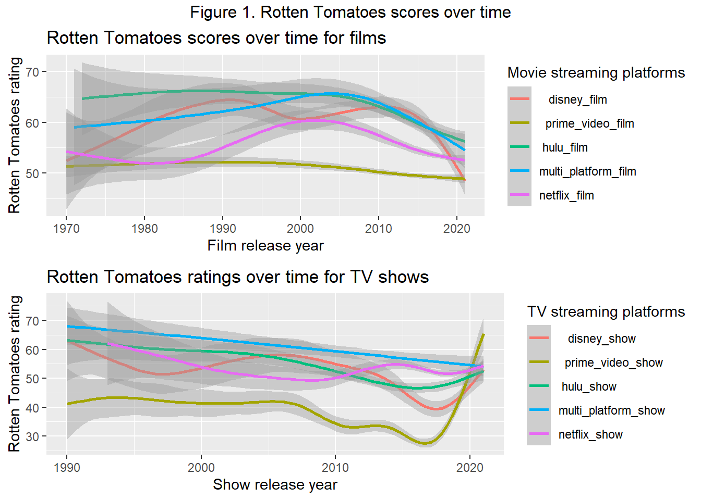
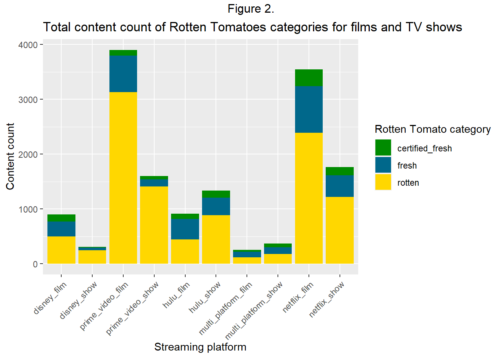
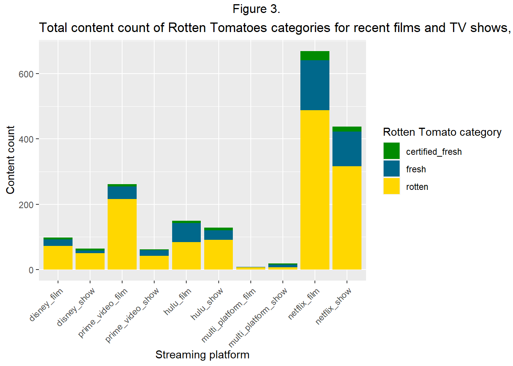
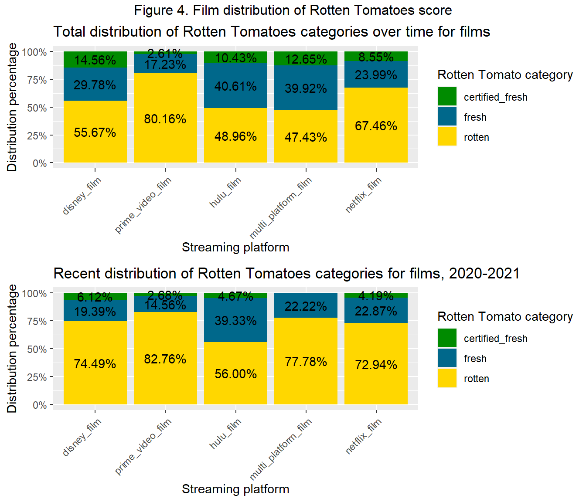
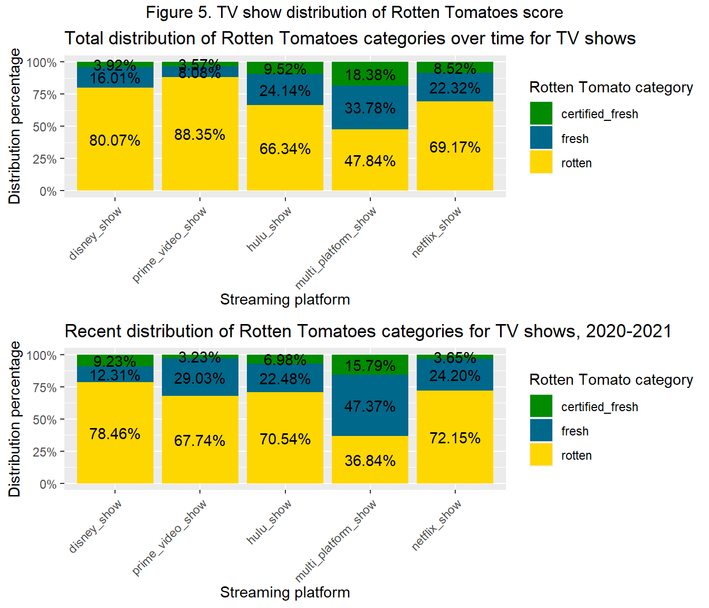
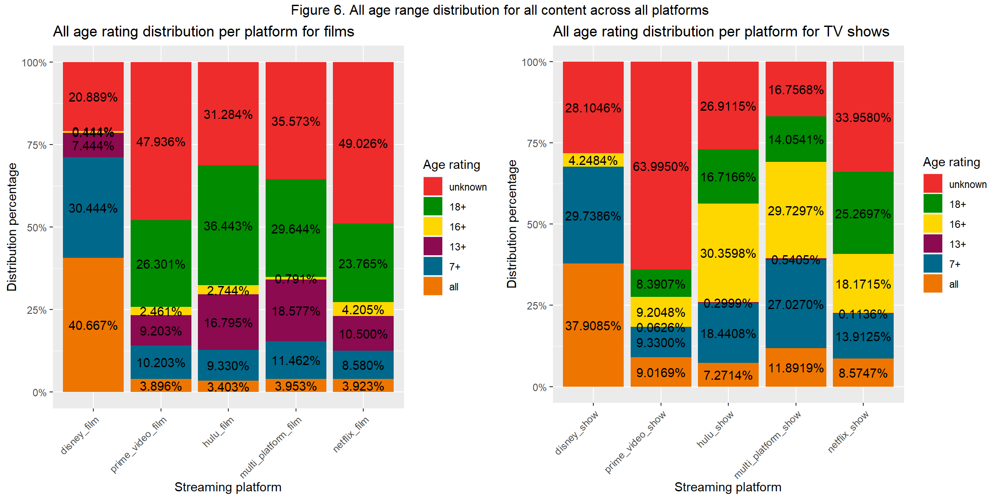
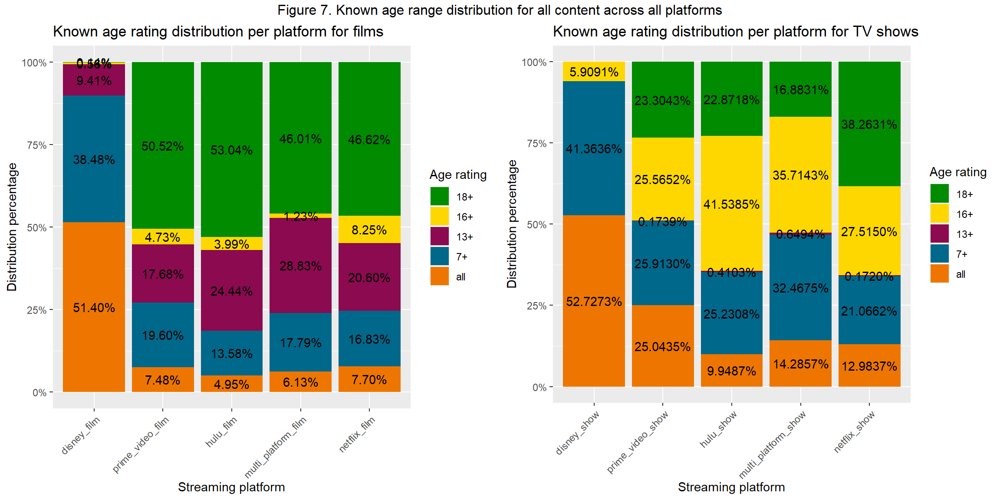

# Rotten Tomatoes Analysis
An analysis of Rotten Tomato ratings across various streaming platforms

This analysis is inspired by a case study completed for the Google Data Analytics Certificate on Coursera. 
The business task is set by a fictional TV company looking to prioritize the software development of various streaming platform applications. They can make applications for different streaming services, but want to focus on ones with highest quality shows and widest age range first. We will be using the two data sets created by Ruchi Bhatia that are available on Kaggle. The first dataset is, “Movies on Netflix, Prime Video, Hulu and Disney+”, found here: (https://www.kaggle.com/datasets/ruchi798/movies-on-netflix-prime-video-hulu-and-disney). The second is data set is, “TV shows on Netflix, Prime Video, Hulu and Disney+”, found here: (https://www.kaggle.com/datasets/ruchi798/tv-shows-on-netflix-prime-video-hulu-and-disney).

The purpose of this script is to clean the data, manipulate it to prepare it for analysis, and then conduct simple analysis to answer: “Which streaming platform offers the highest quality content, as rated by Rotten Tomatoes, and which has the widest viewing age range?”

Historically for films, there is a recent plummet in content quality across all platforms, as seen in Figure 1 above. Disney+ takes a noticeable dip and Prime Video has a low, but steady rating. Historic data for TV shows have an intriguing upswing for Prime Video scoring near 65 and a meeting of all other platforms with scores between 50 and 60. Overall, movies have a decline and most TV shows are meeting to similar scores.

Figure 2. above shows the total content available on all platforms. It is clear that Prime Video has the most content, but also has the most rotten-scoring content, with Netflix close behind. Disney+ and Hulu look similar in their film scores for rotten, fresh, and certified fresh content, but they also do not have nearly as much content as Prime Video or Netflix. The business task want to know about quality of content, so we'll take a quick look at recent content and then examine percent distribution of content ratings.  

 
In Figure 3. we can see that Netflix has been producing the most in terms of recent content, with the majority of it rating rotten. Prime Video is second, with the majority also rating rotten. Hulu has the best distribution for it's new content, but much less. Although we're interested in the highest quality of content, rather than quantity of content, there is a connection emerging; those platforms that have more content tend to have a large amount rated rotten. Now we'll examine percent distribution. 

Figure 4. above shows that all platforms contain at least 47% rotten films; nearly half of all films are scoring a 50 or lower with rotten tomatoes. When you look at recent films, all platforms have an increase in rotten content. Aside from multi-platform films, Hulu has the least percentage of rotten films historically and recently; Hulu also historically has highest percent of fresh films. Recently, Hulu has the least rotten films and the most fresh films. Disney+ has the highest percent of fresh films historically and recently. This figure indicated that Hulu is emerging as having the best overall quality films, with Disney+ have the most top quality films.

Figure 5. shows that platforms have a higher rotten percent distribution for shows than for films, aside from multi-platform shows. Historically, it seems that multi-platform shows have the best rated content. Hulu is in second, with over 66% of it's content rotten. Recently, however, it looks that Prime Video is producing higher quality content. 

Figure 6. above shows all age ratings, including those that have an unknown rating. Prime Video films have nearly 48% of their films rated as unknown, meaning that if consumers have children, age appropriateness of content could be problematic. Disney+ stands out in films and shows as having a over 50% of their content for children aged under 13 years old. For overall age ratings that include the "unknown" rating, Multi-platform films have the most evenly distributed variety, followed by Hulu. For shows, Netflix is most even, followed closely by Hulu.

This figure shows only the known age rating content for the platforms. This data may be considered problematic, as at least 20% of all content across Disney+, Prime Video, Hulu, and Netflix is unknown; this means at least 20% of the data has been cut form these charts. Prime video in particular had 47.9% of films unknown and 64.0% of shows unknown (see Figure 6.). The reason these charts are included is that is parental controls are added to exclude content with an unknown rating, it could dramatically affect the types of content available per platform. As is, Hulu and Prime Video have the most films for an adult audience available and Disney+ has mostly content geared towards a children's audience. For overall age ratings, Netflix has the most even choice for films and Prime Video has the most even selection for shows. 
